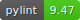

# Features RLGym

This package is here to simplify the addition of features such as ball prediction. The idea is to create an object that automatically adds to whatever component of the environment.

## Installation

| Module        	| Usage                                                                    	| Documentation                                           	|
|---------------	|--------------------------------------------------------------------------	|---------------------------------------------------------	|
| api           	| If you plan on writing features for your own environment                 	| [Documentation](features-rlgym-api/README.md)           	|
| rocket-league 	| If you plan on writing/using features for your Rocket League environment 	| [Documentation](features-rlgym-rocket-league/README.md) 	|

See full documentation: [Full docs](https://feature-rlgym.readthedocs.io/en/latest/index.html)